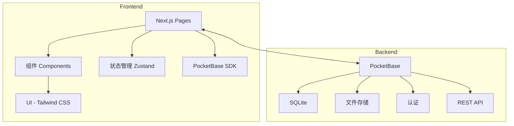

# 报名抽签系统设计文档

## 项目概述

一个基于 Next.js 和 PocketBase 的活动报名抽签系统。管理员可以创建活动并设定中签人数，用户无需注册即可报名参加活动，系统在截止时间后自动随机抽取指定数量的中签用户。

## 技术栈

- **前端**:
  - Next.js 14 (React Framework)
  - TypeScript (类型安全)
  - Tailwind CSS (样式)
  - Zustand (状态管理)
  - React Hook Form (表单处理)
  - Zod (数据验证)
  - PocketBase SDK (数据操作)

- **后端**:
  - PocketBase (后端服务)
    - 数据存储
    - 文件上传
    - 认证授权
    - API访问

## 系统架构



## 数据模型

### Activity (活动)

```typescript
interface Activity {
  id: string;
  title: string;        // 活动标题
  content: string;      // 活动内容
  deadline: Date;       // 截止时间
  winnersCount: number; // 中签人数
  createdAt: Date;      // 创建时间
  updatedAt: Date;      // 更新时间
}
```

### Registration (报名)

```typescript
interface Registration {
  id: string;
  activityId: string;   // 关联活动ID
  name: string;         // 报名者姓名
  photo: string;        // 照片URL
  isWinner: boolean;    // 是否中签
  createdAt: Date;      // 报名时间
}
```

## 项目结构

```
src/
  ├── app/          # App Router
  │   ├── admin/    # 管理员路由
  │   │   ├── page.tsx           # 活动列表
  │   │   ├── new/page.tsx       # 创建活动
  │   │   └── [id]/page.tsx      # 活动详情/编辑
  │   ├── api/      # API 路由
  │   │   └── draw/[id]/route.ts # 抽签API
  │   └── page.tsx  # 首页(活动列表)
  ├── components/   # UI组件
  │   ├── ui/       # 基础UI组件
  │   │   ├── button.tsx
  │   │   ├── input.tsx
  │   │   └── card.tsx
  │   └── forms/    # 表单组件
  │       ├── activity-form.tsx
  │       └── registration-form.tsx
  ├── lib/          # 工具函数
  │   ├── pb.ts     # PocketBase客户端
  │   └── utils.ts  # 通用工具
  ├── styles/       # 全局样式
  └── types/        # 类型定义
```

## 功能实现

### 1. 管理员功能

- 创建活动
  - 设置活动标题、内容
  - 设置报名截止时间
  - 设置中签人数

- 管理活动
  - 查看活动列表
  - 编辑活动信息
  - 查看报名情况

### 2. 用户功能

- 浏览活动
  - 查看活动列表
  - 查看活动详情

- 活动报名
  - 填写姓名
  - 上传照片

- 查看结果
  - 显示是否中签
  - 查看其他中签者

### 3. 系统功能

- 自动抽签
  - 在截止时间后自动执行
  - 随机抽取指定人数
  - 更新中签状态

- 结果展示
  - 展示所有中签者
  - 提供查询接口

## 页面路由

1. `/` - 首页，展示活动列表
2. `/activity/[id]` - 活动详情页
3. `/activity/[id]/register` - 报名页面
4. `/activity/[id]/result` - 抽签结果页
5. `/admin` - 管理员活动列表
6. `/admin/new` - 创建新活动
7. `/admin/[id]` - 管理员活动详情/编辑

## 部署计划

1. 后端部署
   - 准备服务器环境
   - 部署PocketBase服务
   - 配置域名和SSL

2. 前端部署
   - 使用Vercel部署Next.js应用
   - 配置环境变量
   - 设置自定义域名

## 安全考虑

1. 管理员认证
   - 使用PocketBase内置的认证系统
   - 实现基于角色的访问控制

2. 文件上传
   - 限制文件大小和类型
   - 使用PocketBase的安全存储

3. API安全
   - 实现速率限制
   - 验证请求来源
   - 防止重复提交

## 开发计划

1. 环境搭建 (1天)
   - 创建项目
   - 配置开发环境
   - 设置PocketBase

2. 基础功能开发 (3天)
   - 实现数据模型
   - 开发基础UI组件
   - 集成PocketBase SDK

3. 管理员功能 (2天)
   - 活动管理CRUD
   - 管理界面开发
   - 权限控制

4. 用户功能 (2天)
   - 报名流程
   - 文件上传
   - 结果查询

5. 抽签系统 (1天)
   - 随机算法
   - 自动触发
   - 结果通知

6. 测试和优化 (2天)
   - 单元测试
   - E2E测试
   - 性能优化

7. 部署上线 (1天)
   - 服务器部署
   - 域名配置
   - 监控设置
